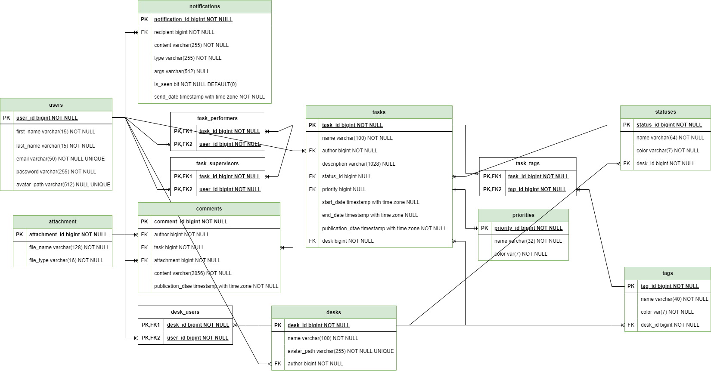

# Kanban desk

A digital board for organizing tasks with customizable columns and drag-and-drop functionality

## Table of Contents

- [Project Overview](#project-overview)
- [Features](#features)
- [Technologies](#technologies)
- [Schema Diagram](#schema-diagram)
- [Getting Started](#getting-started)
- [Usage](#usage)
- [License](#license)

## Project Overview

A Kanban board application built with NodeJS, NestJS, React, and TypeScript, offering simple task management across customizable columns. The system allows users to create, move, and track tasks through different stages of completion. It provides a clear visual representation of workflow, helping teams to identify bottlenecks and manage their workload effectively.

## Features

- [x] User authentication and authorization (JWT)
- [x] User profile creation and management
- [x] Desk creation and management

## Technologies

- React.js
- Zustand
- Material UI
- SASS/SCSS
- Node.js
- Nest.js
- SQL Server
- JWT Authentication
- Passport.js
- Deployment to Azure

## Schema Diagram



## Getting Started

### Prerequisites

Before running the application, make sure you have the following installed:

- Node.js
- SQL Server and SQL Server Management Studio

### Installation

1. Clone the repository

```bash
git clone https://github.com/Kanban-desk/Kanban-desk.git
```
2. Go to the project directory and install dependencies for both the client and server

```bash
cd client
npm install
```

```bash
cd server
npm install
```

3. Create a `.env` file in both the `client` and `server` directories and add the environment variables as shown in example below:
```json
NODE_ENV=development
AZURE_SQL_SERVER=localhost
AZURE_SQL_PORT=1433
AZURE_SQL_DATABASE=kanban-desk-database
AZURE_SQL_USERNAME=sa
AZURE_SQL_PASSWORD=yourPassword
PORT=8080
APP_SECRET=yourSecretKey
CLIENT_ID=yourGoogleClientID
CLIENT_SECRET=yourGoogleClientSecret
CALLBACK_URL=http://localhost:8080/api/auth/google/redirect
```

4. Start the server

```bash
cd server
nest start
```

5. Start the client

```bash
cd client
npm run dev
```

## Running migratons
```bash
# Generate a migration from schema changes
npm run migration:generate pathToMigratonsFolder/MigrationName

# Run migrations and checks for schema changes
npm run migration:run
```